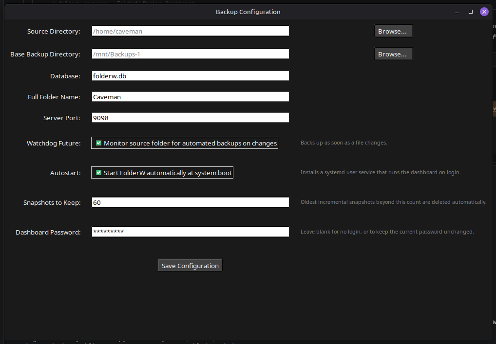
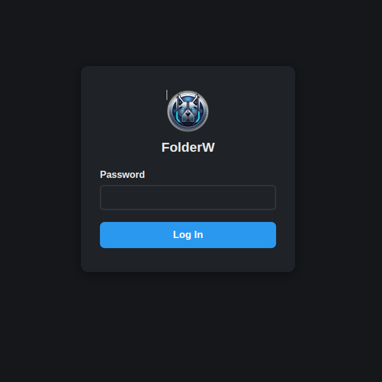

<p align="center">  </p>
<h1>FolderW</h1>

# A Python Incremental/Differential Backup with Watchdog or Scheduling, Backup Automation with Tkinter GUI and Event-Driven (when changing, adding, or deleting files) Monitoring


This project is designed to simplify and automate the process of backing up files from a specified source directory to a target directory. Key features include:

> **Platform support:** FolderW currently works on **Linux only**. It relies on `rsync` and other Linux-specific tooling, and hasn't been tested on macOS or Windows.

> **Source scope:** For now, `SRC_DIR` must be a local path — either on the machine's internal drive or an external/USB drive, as long as it's already mounted before FolderW starts. Network shares and remote/cloud sources aren't currently supported.

## Features

1. **Graphical User Interface (GUI):**
   - Built using Tkinter for a user-friendly configuration process.
   - Allows users to select directories and files through a GUI.
   - Offers options to enable or disable event-driven backups.

2. **Environment Configuration:**
   - Uses a `.env` file to store configuration settings securely.
   - Includes a setup script to create and configure the `.env` file.

3. **Virtual Environment Management:**
   - Provides an `install.sh` script to set up a Python virtual environment.
   - Automatically installs required packages from `requirements.txt`.

4. **Automated Backups:**
   - Supports both regular scheduled backups and event-driven backups.
   - Utilizes `rsync` to efficiently copy files from the source to the backup directory.

5. **Logging and Error Handling:**
   - Comprehensive logging to monitor the backup process.
   - Robust error handling to ensure reliable execution.

6. **Integration with `ttkthemes`:**
   - Enhances the Tkinter GUI with a visually appealing dark theme.

7. **Autostart on Boot:**
   - Optional checkbox in the setup GUI installs a systemd user service so the dashboard starts automatically on login/boot.

8. **Restore:**
   - Dashboard page listing the full backup and every snapshot, with the ability to restore an entire backup or browse/search and hand-pick individual files.

9. **Snapshot Retention:**
   - Optional limit on how many snapshots to keep — oldest ones are deleted automatically after each backup. The full backup is never part of this pool.

10. **Backup History:**
    - Dashboard page listing every backup run ever recorded (timestamp, type, snapshot, files changed, status), separate from the `/manage-databases` page for cleaning up leftover `.db` files.

11. **Branded Backup Folder:**
    - Both the full backup and its container folder get their own custom folder icon (a physical icon file plus `gio set metadata::custom-icon`, so it shows correctly across file managers), recognizable at a glance instead of a plain folder.

    <p align="center">  </p>

## Quick Start

Copy and run the commands below to deploy FolderW:

```bash
git clone https://github.com/Cuban100/FolderW.git
cd FolderW
chmod +x install.sh
./install.sh
```

## Updating

Already have FolderW installed and just want the latest version? Run `update.sh` from inside your existing installation folder:

```bash
cd FolderW
chmod +x update.sh
./update.sh
```

It pulls the latest code, updates dependencies, and — if the autostart systemd service is set up — restarts it automatically so the update actually takes effect (a running Python process keeps running whatever code it started with until it's restarted; `git pull` alone doesn't affect it). If a backup happens to be running at the moment, the automatic restart is skipped so it isn't interrupted — restart manually once it finishes.

**Your `.env` file and database are never touched.** Both are already excluded from version control, so `git pull` doesn't even see them — nothing about the update process can overwrite your settings or backup history.

## Uninstalling

Run `uninstall.sh` from inside your installation folder to remove FolderW completely:

```bash
cd FolderW
chmod +x uninstall.sh
./uninstall.sh
```

It shows a warning and asks for confirmation before doing anything. Once confirmed, it stops and kills every FolderW process (the systemd services and any that ended up running outside of them), removes both systemd unit files, and then **permanently deletes the entire cloned repository folder — including your `.env` configuration and the `folderw.db` database.**

**Your actual backed-up data is never touched.** Only the tool itself is removed — whatever's at `BASE_DIR` (the full backup and any incremental snapshots) is left exactly as it was.

## Key Components

- **`install.sh`:** Bash script to create a virtual environment, install dependencies, and run the setup script.
- **`update.sh`:** Bash script to update an existing installation to the latest version. See [Updating](#updating) below.
- **`setup.py`:** Tkinter-based GUI for configuring backup settings and initializing the environment.
- **`rsync_incremental.py`:** Runs the initial full backup (shared by both methods) and every Incremental-mode snapshot after it.
- **`rsync_differential.py`:** Runs every Differential-mode snapshot; reuses `rsync_incremental.py`'s shared machinery directly. See [Backup Method](#backup-method).
- **`main_backup.py`:** Script triggered to start the backup process; picks whichever of the two above matches the configured Backup Method.

## Usage

1. **Setup:**
   - Run `install.sh` to set up the project environment.
   - Use the Tkinter GUI (`setup.py`) to configure paths and settings.
   - Save the configuration to generate the `.env` file.

   <p align="center"></p>

2. **Execution:**
   - The system can watch the source directory for changes and perform backups automatically.
   - Manual backups can also be initiated as needed.

## Login

The dashboard has no login page by default. Set a **Dashboard Password** (in `setup.py` or the web Settings page) to require one — only a salted, hashed version of the password is ever stored, never the plaintext. Once set, every page (including Settings) requires logging in first.

Sessions last **15 days** via a signed cookie, so you won't need to log in again on the same browser until it expires or you explicitly log out. Uncheck **Require Login** in Settings to disable the login page again.

<p align="center"></p>

## Notifications

Set **Notification URL(s)** (in `setup.py` or the web Settings page) to be notified when a backup fails, and when the initial full backup completes. Uses [Apprise](https://github.com/caronc/apprise), which supports 100+ services through simple URL strings — Pushover, ntfy, Pushbullet, Discord, Telegram, email, and more. Enter one or more, comma-separated:

```
pover://user@token
ntfy://topic
pbul://accesskey
```

See the [Apprise README](https://github.com/caronc/apprise#supported-notifications) for the full list of supported services and URL formats. Use the **Send Test Notification** button in Settings to verify a URL works before saving.

## Autostart on Boot (systemd)

Checking **"Start FolderW automatically at system boot"** in the setup GUI installs and enables a systemd **user** service (`folderw.service`) that runs `server.py` on login/boot. No root/sudo is required — it's managed entirely through `systemctl --user`.

The service unit lives at `~/.config/systemd/user/folderw.service`. Useful commands:

```bash
# Check whether it's running
systemctl --user status folderw

# Stop / start / restart it
systemctl --user stop folderw
systemctl --user start folderw
systemctl --user restart folderw

# Turn autostart off/on without deleting the unit file
systemctl --user disable folderw
systemctl --user enable folderw

# Tail its logs
journalctl --user -u folderw -f
```

**Note:** always use `--user` with these commands — this is a per-user service (`~/.config/systemd/user/`), not a system-wide one (`/etc/systemd/system/`), so plain `systemctl` (without `--user`) won't find it.

If the dashboard doesn't come up automatically before you log in (e.g. on a headless server), you may need to run `loginctl enable-linger $USER` once so your user services can start without an active login session; setup.py attempts this automatically and prints a note if it couldn't.

Unchecking the autostart box and saving again disables the service (`systemctl --user disable`), but does not delete the unit file.

## Restore

The **Restore** page (`/restore` in the dashboard) lists two kinds of backups:

- **Full Backup:** created once, on the very first backup ever, at `BASE_DIR/FULL_NAME/Full Backup` — a complete, standalone copy of `SRC_DIR` at that moment. Frozen after that: no later run ever touches it again, regardless of which Backup Method is active.
- **Snapshots:** one entry per backup session after the initial full backup, stored under `BASE_DIR/FULL_NAME/Snapshots/<Month>/<Day>/<Time>/` (e.g. `August 06, 1:09-PM`). What each one contains depends on the [Backup Method](#backup-method) that was active when it ran — a complete tree (Incremental) or only the changed files (Differential).

`FULL_NAME` (set in the setup GUI or the web Settings page as "Full Backup Folder Name") is the container folder created inside `BASE_DIR` that holds both `Full Backup/` and `Snapshots/` — e.g. with `FULL_NAME=Documents`, everything lives under `BASE_DIR/Documents/`.

## Backup Method

FolderW supports two strategies for every backup after the initial one (set in the setup GUI or the web Settings page as "Backup Method"):

- **Incremental** — each snapshot compares against the *previous* snapshot and is a complete, independently restorable copy: unchanged files are hardlinked in at no extra disk cost, changed files are written fresh. Snapshots stay small and roughly constant in size no matter how long the system has been running. This is how Time Machine and Timeshift work.
- **Differential (default)** — each snapshot compares directly against the *original* full backup and contains only the files that are new or changed since it — a true delta, not a complete copy. Snapshots grow larger over time as more changes accumulate since the original; restoring a specific point in time needs the full backup plus that one snapshot together. This is the industry-standard definition of a differential backup.

For any backup you can either:

- **Restore Entire Backup** — copies everything in it, or
- **Browse / Search** — drills into that one backup, with a search box, and lets you select individual files to restore.

Restoring **never overwrites `SRC_DIR`**. Files are always copied into a new, timestamped folder at `BASE_DIR/Restored/<timestamp>_<backup>/` for you to review and move back into place yourself — a wrong pick can't clobber current data.

## Snapshot Retention

Set **"Snapshots to Keep"** (in the setup GUI or the web Settings page) to a number, and after every backup FolderW deletes the oldest snapshots beyond that count — keeping only the most recent N. Leave it blank to keep every snapshot forever (the default).

This only ever deletes `Month/Day/Time` folders under `BASE_DIR/FULL_NAME/Snapshots`; the full backup is never part of this retention pool at all (not just protected within it) — it's a one-time backup, not something new runs add to.

Deleting a file from `SRC_DIR` behaves differently depending on which backup you look at:

- **Full backup:** frozen after its one-time creation, so it keeps whatever it captured then, regardless of later deletions from `SRC_DIR`.
- **Incremental snapshots:** deletions are never recorded in a snapshot — a deleted file simply stops appearing in *future* snapshots, but stays intact in whichever earlier snapshot last captured it, so you can still recover it from there via Restore.
- **Differential snapshots:** since each one only contains what's new or changed relative to the full backup, a file deleted from `SRC_DIR` simply won't appear in that snapshot's delta — it's still recoverable from the full backup itself.

## What Gets Backed Up

By default, FolderW backs up **everything** under `SRC_DIR` — every file and folder, recursively — except what's listed in `logs/rsync_exclude.txt`. There's no allowlist or file-type filtering; if it's not excluded, it's included.

### Default Exclusions

A handful of patterns are excluded out of the box, for a few different reasons:

**FolderW's own files** — if `SRC_DIR` is (or contains) FolderW's own install folder, these stop it from backing up itself:
- `logs/`, `rsync.log`, `rsync.txt`, `.log` — FolderW's own log files
- `lib`, `__pycache__` — the Python virtual environment and bytecode cache
- `folder-icon.png`, `FolderW.png`, `.directory` — the branding files FolderW writes into the backup folder itself (see [Branded Backup Folder](#features))

**Generic junk** — has no value in a backup regardless of what app created it:
- `.cache/` — cache directories in general
- `*.tmp`, `*.swp`, `*.swx`, `~*` — temp files and editor swap/backup files
- `*.db-journal` — transient SQLite rollback journals, recreated every transaction, never meaningful to restore

**Sparse virtual-disk and container/VM tooling state** — the important one to understand. Tools like Docker Desktop and dev VM sandboxes create disk image files with a huge *apparent* size but a much smaller *real* size on disk (a "sparse" file — mostly empty space, not actually allocated). A naive backup doesn't know the difference: it reads through the whole apparent size and can end up writing a multi-hundred-GB file to your backup destination for a few real GB of content, and along the way it can make progress percentages look wildly wrong (rsync reports having "transferred" the file's huge logical size long before real progress reflects it). None of this is data you'd actually want to restore anyway — it's regenerable tooling state, not personal files:
- `overlay2/`, `**/.local/share/docker` — Docker's storage driver and full data directory (images, containers, volumes, build cache)
- `**/.docker/desktop/vms` — Docker Desktop's own VM disk (`Docker.raw`)
- `**/.config/Claude/vm_bundles` — Claude Code's sandboxed VM disk images
- `**/.npm/_cacache` — npm's downloaded-package cache (not sparse, just large and fully regenerable)

If you use other tools with similar sparse virtual-disk files (VirtualBox, VMware, QEMU/libvirt, other container runtimes), consider excluding those too — see below.

### Excluding Your Own Files

`logs/rsync_exclude.txt` lists patterns, one per line, to skip — add your own for anything specific to your `SRC_DIR` (build output, another app's cache, a specific large file, etc.).

Pattern syntax follows `rsync`'s filter rules: a bare name (`node_modules`) matches that name anywhere in the tree; a pattern with a `/` in it (other than a trailing one) is anchored to `SRC_DIR`'s root; use a `**/` prefix (e.g. `**/some/nested/path`) to match a nested path at any depth, and to reliably exclude that path from FolderW's own size/progress calculations too (which use a slightly different wildcard engine than `rsync` itself — `**/` is the form verified to work correctly for both).

This one file drives both **what gets backed up** (rsync's `--exclude-from`) and **what the watchdog reacts to** — a change inside an excluded path won't reset the 2-minute debounce timer either, so a busy cache directory can't perpetually delay a real backup. Changes to this file take effect the next time a backup runs or the watchdog restarts.

## Permissions

The actual `rsync` transfer runs as **root**, via a passwordless `sudo` rule scoped specifically to the `rsync` binary (`setup.py` configures this automatically — see `configure_rsync_sudo()`). Nothing else in FolderW runs elevated; the dashboard, the watchdog, and everything else stay as your regular user.

Why: files under `SRC_DIR` aren't always owned by you. A common case is Docker containers writing into a bind-mounted config directory using their own internal user — found in practice with a WireGuard container's peer configs, owned by a UID with no relation to the host account, `700`/`600` permissions, unreadable by a plain user-level process. Without root, rsync can't read those files at all; it isn't a bug it can work around on its own.

This is scoped as narrowly as sudo allows: the rule grants `NOPASSWD` on the `rsync` binary specifically (found via `shutil.which`), not blanket root access, and only after checking a rule allowing this doesn't already exist (some systems already have broader passwordless sudo configured for other reasons — in that case nothing new is added). The sudoers file is written to `/etc/sudoers.d/folderw-rsync` and validated with `visudo -c` before ever being installed, so a malformed rule can't break `sudo` system-wide.

If setup couldn't configure this automatically (`sudo`/`visudo` not installed, etc.), it prints the exact command to run manually — or backups will still work either way, just skipping (not hanging on) any file they don't have permission to read.

**Every copy in the backup always comes out owned by whoever runs FolderW, mode `775`** — regardless of the source file's own owner or permissions. Reading as root is only what lets rsync see files it otherwise couldn't; what actually lands in the backup is deliberately normalized (`--chown`/`--chmod`) rather than preserving another UID or a restrictive mode from the source.

This project aims to streamline backup operations, providing a reliable and user-friendly solution for both regular and event-driven file backups.
